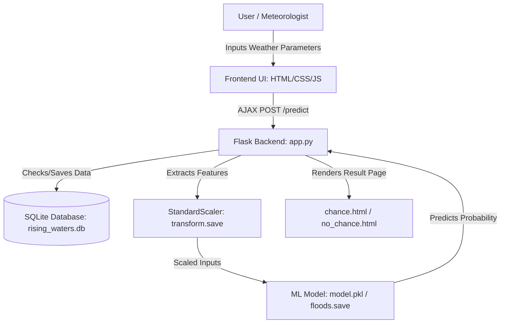

# Rising Waters: AI-Powered Flood Prediction System

## Project Description:
Rising Waters harnesses Machine Learning to provide intelligent flood risk prediction, offering disaster management authorities and citizens a fast, data-driven forecasting experience. The platform includes a Flood Predictor module, which calculates flood probability based on weather parameters (Temperature, Humidity, Cloud Cover, and rainfall metrics), a Supervisor Dashboard displaying real-time predictions, historical trends, and model comparisons, and an interactive History Log that records past queries for local analysis.

Using a trained Random Forest and XGBoost ensemble (achieving 96.55% accuracy), the platform processes meteorological parameters to deliver reliable risk classifications. Built with Flask and styled with the premium Lumina Hydro design system, the system ensures a seamless user experience. With secure user authentication using scrypt hashing and modular database structures via SQLite, Rising Waters empowers local authorities to make preemptive decisions and coordinate emergency services with confidence.

---

## Scenarios

* **Scenario 1**: A local citizen inputs low seasonal rainfall data (e.g., ANNUAL = 2100mm, sub-divisional rainfall = 250mm, Temp = 30°C). The system predicts a "Low Risk" (12% probability), rendering a calming green interface with advice for normal agricultural activities.
* **Scenario 2**: An on-duty meteorologist inputs heavy monsoon parameters (e.g., Cloud Cover = 44%, Jun-Sep rainfall = 2400mm, sub-divisional rainfall = 800mm, Temp = 28°C). Rising Waters immediately detects a "Critical" flood threat (85% probability), displaying a bright red high-contrast warning page with prompt instructions to initiate emergency sirens, evacuate low-lying banks, and coordinate with the district disaster management cell.
* **Scenario 3**: A supervisor accesses the global dashboard to audit past warnings and evaluate model accuracies. They review confusion matrices, compare precision-recall curves for Random Forest vs. XGBoost, and download descriptive statistical reports for municipal records.

---

## Technical Architecture

### Architecture Description:
Rising Waters utilizes a modular three-tier architecture to deliver rapid, AI-driven content generation:
* **Frontend**: A responsive user interface built with HTML5, vanilla CSS, and JavaScript. Styled with the Lumina Hydro glassmorphism design system to provide visual clarity.
* **Backend**: Flask-based controller orchestrating user session management, data validation, database logging, and model inference.
* **Database**: SQLite database with schemas for user credentials, meteorological inputs, and prediction runs.
* **Model Inference**: Integrates pre-trained StandardScaler and XGBoost/Random Forest classifiers to output risk scores.

### Pre-requisites:
* **Flask Framework Knowledge**: [Flask Documentation](https://flask.palletsprojects.com/)
* **Machine Learning Concepts**: [Scikit-Learn Documentation](https://scikit-learn.org/) / [XGBoost Documentation](https://xgboost.readthedocs.io/)
* **HTML, CSS, and JavaScript Skills**: [W3Schools HTML/CSS/JavaScript Tutorials](https://www.w3schools.com/)
* **Python Programming Proficiency**: [Python Documentation](https://docs.python.org/3/)
* **Version Control with Git**: [Git Documentation](https://git-scm.com/doc)
* **SQLite Database Knowledge**: [SQLite Documentation](https://www.sqlite.org/docs.html)

---

## Project Workflow

### Milestone 1: Model Selection and Architecture
* **Activity 1.1**: Research and compile historical regional meteorological data (`dataset/flood dataset.xlsx`).
* **Activity 1.2**: Evaluate classifier options (Decision Tree, Random Forest, KNN, XGBoost) and select the optimal model.
* **Activity 1.3**: Define the application architecture and SQLite data schema relations.
* **Activity 1.4**: Set up the local development environment, installing Python dependencies (pandas, scikit-learn, xgboost, flask, joblib).

### Milestone 2: Core Functionalities Development
* **Activity 2.1**: Implement the preprocessing pipeline (median imputation, IQR outlier capping, and standard scaling).
* **Activity 2.2**: Train and save the best models (`floods.save`, `transform.save`) using `train_model.py`.

### Milestone 3: App.py Development
* **Activity 3.1**: Write the core Flask controller in `app.py`, defining routes for user authentication, prediction inference, historical records, and dashboard metrics.
* **Activity 3.2**: Establish SQLite database integrations in `database.py` with tables for users, weather data, and prediction outputs.

### Milestone 4: Frontend Development
* **Activity 4.1**: Design and develop the user interface using HTML5, vanilla CSS, and JavaScript, incorporating Lumina Hydro's glassmorphism style.
* **Activity 4.2**: Create dynamic templates with Flask’s `render_template` to render risk-dependent warning pages.

### Milestone 5: Deployment & Verification
* **Activity 5.1**: Deploy the application publicly on Render, linking the SQLite backend and environment paths.
* **Activity 5.2**: Conduct performance load testing using Locust to verify response times and throughput under load.

### Milestone 6: Conclusion

---

## Exploring the Website's Web Pages

### Home / Generator Page:
* **Description**: The landing page of Rising Waters serves as the public entry point. It features a dark glassmorphism design with animated background blobs, explaining the project's purpose and guiding users to register or log in.

### Input Section:
* **Description**: A glass-styled input form accessible to logged-in meteorologists. Users enter current weather parameters (Temperature, Humidity, Cloud Cover, and seasonal rainfall amounts). JavaScript limits client-side inputs to reasonable boundaries to ensure high prediction quality.

### Results Section:
* **Description**: Dynamically rendered based on prediction outcomes:
  * **Flood Warning (High/Critical Risk)**: Renders a warning page (`chance.html`) containing threat details and emergency instructions.
  * **Safe Region (Low/Moderate Risk)**: Renders a success page (`no_chance.html`) validating safety.

### Supervisor Dashboard:
* **Description**: Provides supervisors with real-time prediction metrics, descriptive statistical logs, and correlation heatmaps comparing Decision Tree, Random Forest, KNN, and XGBoost performance.

### History Logs:
* **Description**: Table listing previous prediction runs. Authorized administrators can clear global history.

---

## Conclusion
Rising Waters demonstrates how machine learning models can be integrated into emergency management workflows. By using a trained Random Forest and XGBoost ensemble, local disaster cells are equipped with highly accurate, real-time flood forecasting, minimizing response latency and saving lives.
